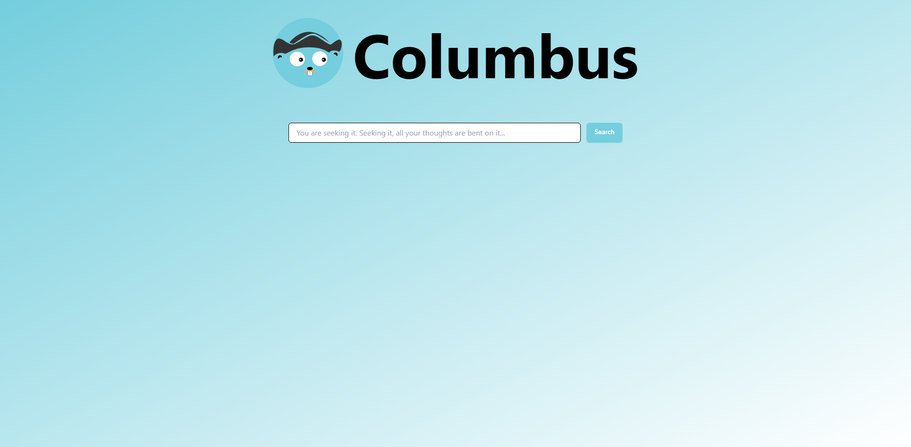

# Columbus

Columbus is a cloud-based search engine that makes searching your hosted cloud apps on your Kubernetes instances feel.

## Introduction

It is a self-hosted search engine and cralwer that can be deployed on your Kubernetes cluster and can be used to search your cloud hosted docs,apps or any other service that you want to search.

## License

Columbus is licensed under the [Apache Version 2.0 License](LICENSE).
